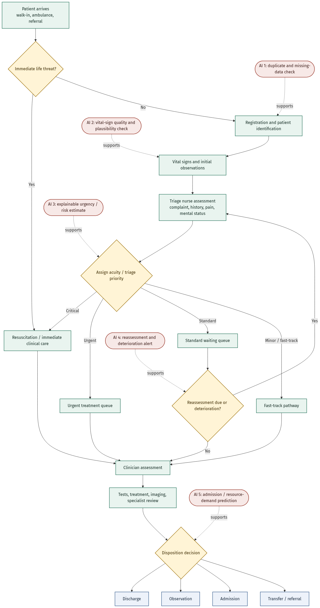

# Week 3: Healthcare Workflows and Systems Thinking

Week 3 focuses on designing clinical AI around the realities of healthcare work. A model can perform well in a notebook and still fail if it interrupts nurses, depends on delayed information, or ignores the capacity constraints of the emergency department.

## Week Theme

**Design with clinical staff, not at them.**

## Objectives

- Map the current emergency department triage workflow.
- Identify decision points, delays, handoffs, and information loss.
- Annotate three to five plausible AI plug-in points.
- Name three workflow constraints that the AI design must respect.
- Identify five clinical stakeholders and their main concerns.
- Expand the proposal literature base to at least 10 papers.
- Add systems-thinking content to the preliminary proposal.

## Assignment Map

| Task | Status | Evidence |
| --- | --- | --- |
| Structured workflow notes | Draft complete; validate against video/shadowing | [`assignments/Task1_Workflow_Study_Notes.md`](assignments/Task1_Workflow_Study_Notes.md) |
| Workflow diagram | Source and exports complete | [`Mermaid source`](diagrams/mercer-ed-triage-workflow.mmd), [`SVG`](diagrams/mercer-ed-triage-workflow.svg), [`PNG`](diagrams/mercer-ed-triage-workflow.png) |
| Constraints and stakeholders | Complete draft | [`assignments/Task3_Constraints_and_Stakeholders.md`](assignments/Task3_Constraints_and_Stakeholders.md) |
| Proposal refinement | Draft added to proposal | [`../docs/week-1-preliminary-proposal.md`](../docs/week-1-preliminary-proposal.md) |
| Literature expansion | Three candidate references prepared for Zotero | [`assignments/week-3-zotero-import.ris`](assignments/week-3-zotero-import.ris) |
| Career challenge | Draft complete | [`assignments/Anti_Procrastination_Protocol.md`](assignments/Anti_Procrastination_Protocol.md) |

## Interim Submission

- Draft workflow notes
- Initial workflow diagram
- Shortlist of three workflow constraints

## Final Submission

- Refined proposal
- Literature review with 10+ papers
- Workflow diagram
- Constraints and stakeholders section

## Important Validation Note

The workflow is a first-pass model based on the Week 3 scenario and common emergency department processes. It must be checked against the assigned walk-through video or real shadowing notes. Any difference observed in the actual Mercer scenario should replace the assumptions in this draft.

## Reflection

Week 3 shifts the project from asking whether a model can make a prediction to asking whether the prediction can fit safely into real work. Clinical value depends on timing, usability, information quality, staffing, handoffs, and the ability of clinicians to understand and override the tool.
